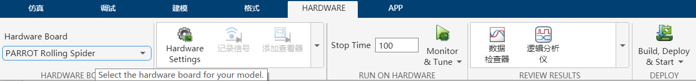
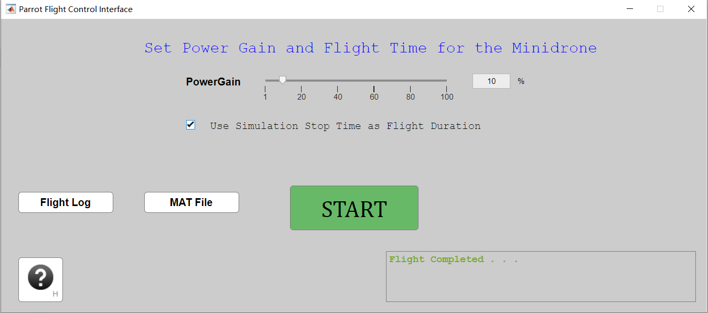

# gettingstarted连接教程

## 准备工作

完成[无人机与电脑连接](与电脑连接.md)的教程。

## gettingstarted
1. 在MATLAB命令行里输入`parrot_gettingstarted`打开对应的Simulink项目。

2. 选中项目中的**HARDWARE**。

3. 在hardware board里选择**正确**的机型（这一步官方教程没有提及）。
    
   
4.点击上图中的**Build，Deploy&Start**选项

5.进入如下页面，点击Start按钮，开始测试飞行（Powergain不要设置太大，不要让它起飞）。
  取消勾选，可以设置飞行时间。
    
6.完成飞行
## 效果展示
[点击这里观看视频](image/gettingstarted效果展示.mp4)
