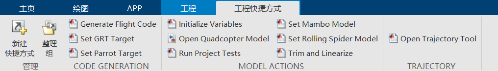
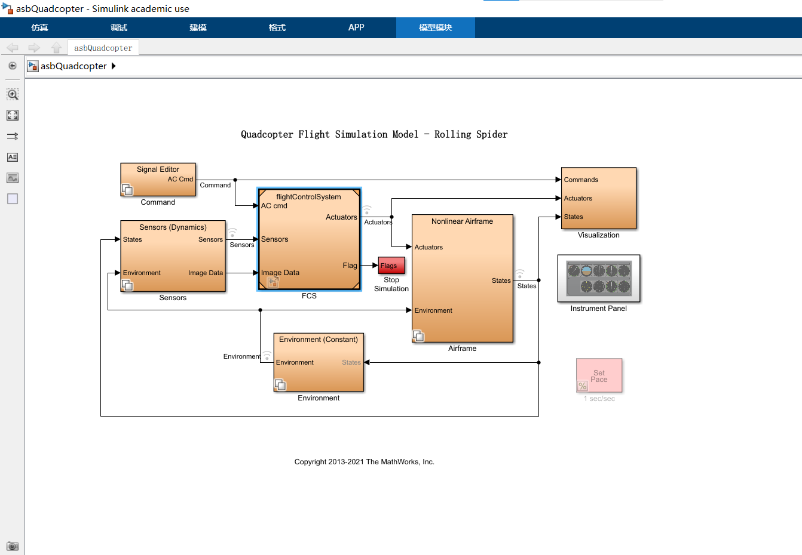
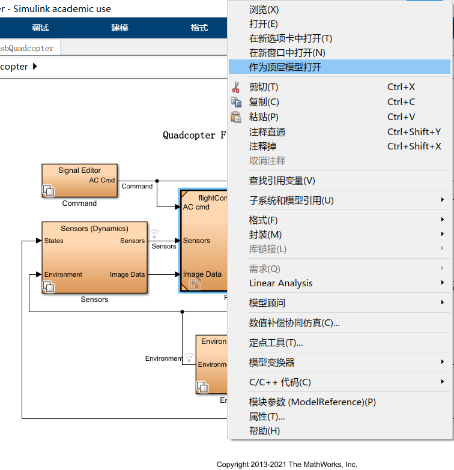

# quadcopter连接教程

## 准备工作

- 完成[无人机与电脑连接](与电脑连接.md)的教程。
- 安装了 MATLAB 和 Simulink。
- 安装了 Aerospace Blockset
         Optimization Toolbox
         Simulink Control Design
         Signal Processing Toolbox
         Computer Vision Toolbox
          Simulink 3D Animation。
## gettingstarted
1. 完成[无人机与电脑连接](与电脑连接.md)的教程，实现无人机与电脑的连接。

2. 在MATLAB命令行里输入`asbQuadcopterStart`打开对应的Simulink项目。

3. 点击工程快捷方式中的'Set Parrot Target.m。
    

4. 在主页确认是**正确**的机型。
   
   
5.右击图中的flightcontrolsystem，选择作为**顶层模型打开**。
    

6.同[gettingstarted教程](gettingstarted.md)，选择**HARDWARE**选项卡，并部署到无人机上

7.进入如下页面，点击Start按钮，开始测试飞行（Powergain设置为100%，否则无法起飞）。
  取消勾选，可以设置飞行时间。
  
    
8.完成飞行
## 效果展示
[点击这里观看演示视频](https://wwszkty.github.io/parrot-rolling-minidrone-with-matlab/index.html)
