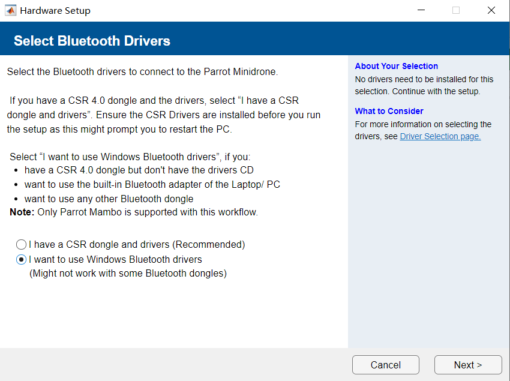

# Parrot Minidrone与电脑连接教程

本教程将引导你如何从头开始，将Parrot Minidrone与电脑连接。（MATLAB版本为R2022a）

## 准备工作

在开始之前，请确保你已经具备以下条件：
- 安装了 MATLAB 和 Simulink。
- 安装了 Simulink Support Package for Parrot Minidrone（版本为22.1.1）。
  （点击主页中的**附加功能**，搜索 ` Simulink Support Package for Parrot Minidrone` 找到相应的支持包即可下载）

## 无人机与电脑的连接

### 第一步：找到支持包
1. 打开 MATLAB，点击主页中的**附加功能**（ **Add-Ons**） 按钮下方的箭头。
2. 选择**管理附加功能**选项
3. 搜索 ` Simulink Support Package for Parrot Minidrone` 找到相应的支持包。
4. 如下图所示找到设置按钮（齿轮），并单击进入支持包。
   

### 第二步：根据提示进行相应操作
1.选择图中第二个选项，即蓝牙

## 常见问题与解决方案

...

