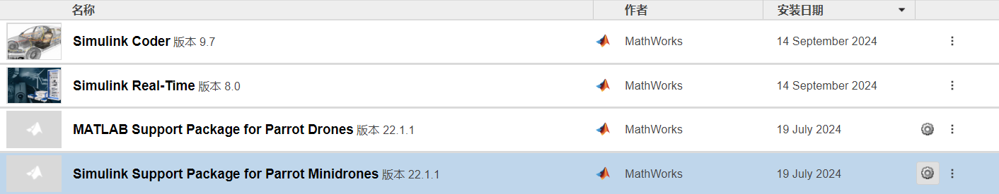

# Parrot Minidrone与电脑连接教程

本教程将引导你如何从头开始，将Parrot Minidrone与电脑连接。（MATLAB版本为R2022a）

## 准备工作

在开始之前，请确保你已经具备以下条件：
- 安装了 MATLAB 和 Simulink。
- 安装了 Simulink Support Package for Parrot Minidrone（版本为22.1.1）。
  （点击主页中的**附加功能**，搜索 ` Simulink Support Package for Parrot Minidrone` 找到相应的支持包即可下载）

## 无人机与电脑的连接

### 第一步：找到支持包
1. 打开 MATLAB，点击主页中的**附加功能**（ **Add-Ons**） 按钮下方的箭头。

2. 选择**管理附加功能**选项

3. 搜索 ` Simulink Support Package for Parrot Minidrone` 找到相应的支持包。

4. 如下图所示找到设置按钮（齿轮），并单击进入支持包。
   

### 第二步：根据提示进行相应操作

1. 选择图中第二个选项，即蓝牙，之后点击右下方 **Next >**  
   

2. 根据提示将 **开机** 的无人机与电脑通过数据线连接，之后点击右下方 **Next >**

3. 电脑会自动检测到与其连接的无人机，之后点击右下方 **Next >**

4. 等待 **Writing Firmware** 结束后，根据提示断开数据线，等待无人机灯闪烁结束，绿灯稳定后，关机。等绿灯完全熄灭后，重新开机。之后点击右下方 **Next >**。

5. 可以参阅新页面中的关于连接蓝牙的链接。打开电脑的蓝牙图标，右击后选择 **加入个人区域网**，找到RS开头的设备，右击后选择**直接连接**。
   

6.在新页面点击**update**（确保电脑断网），更新完毕后，点击右下方 **Next >**。

7.重复5操作

8.在新界面上点击**Test Connection**，如正常，则点击右下方 **Next >**。

9.结束教程，并开启Simulink相关示例

## 常见问题与解决方案

...

